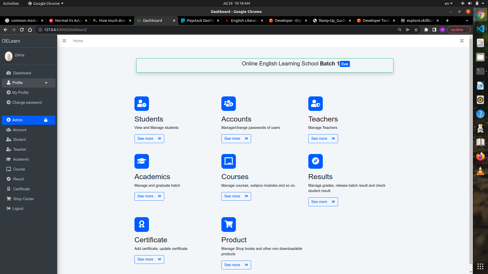
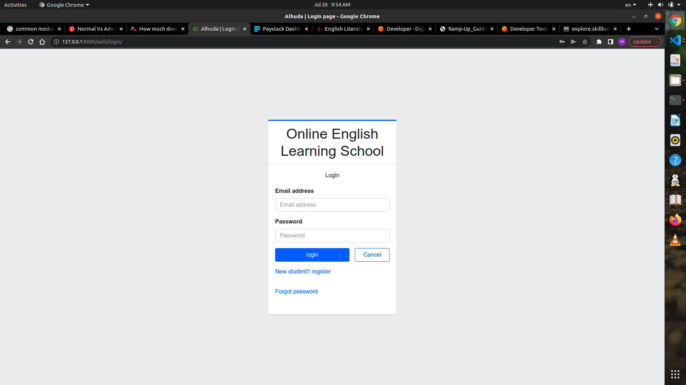
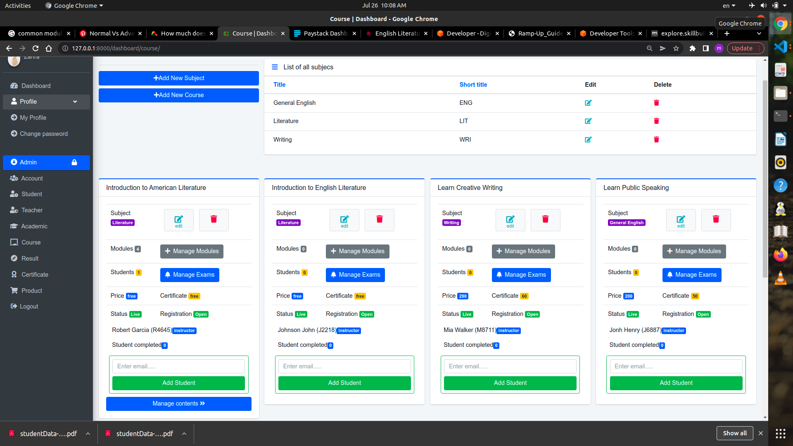
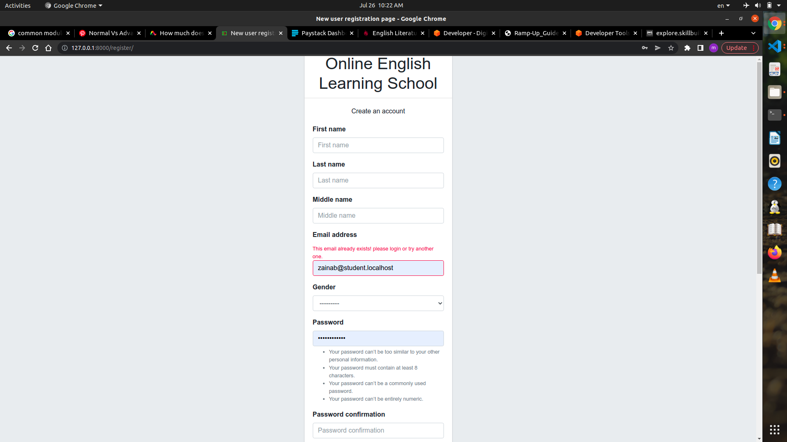
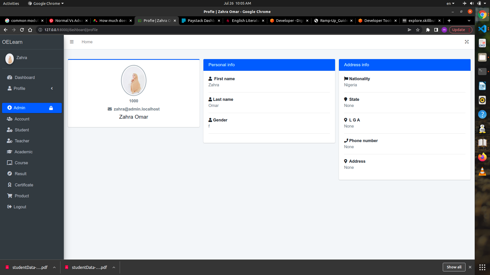
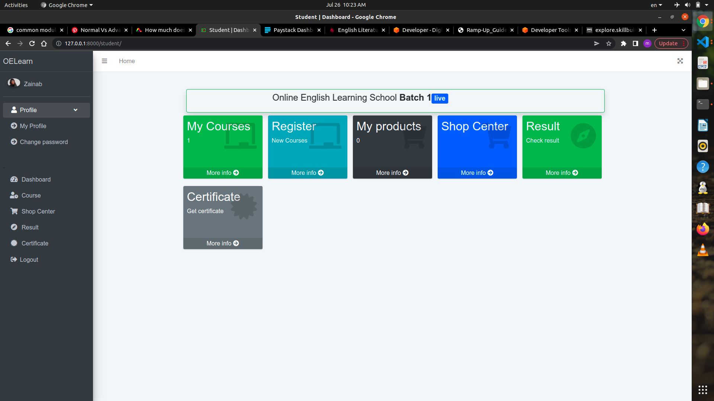
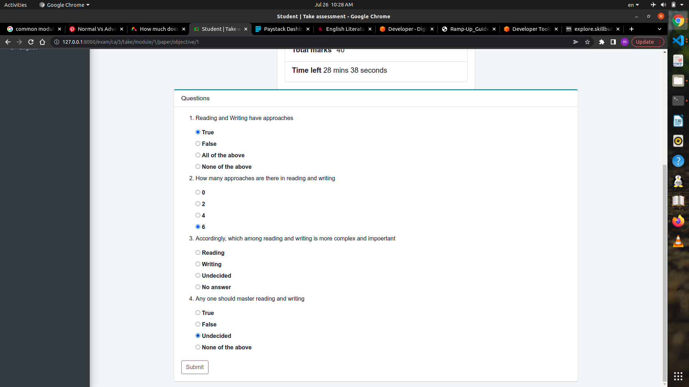
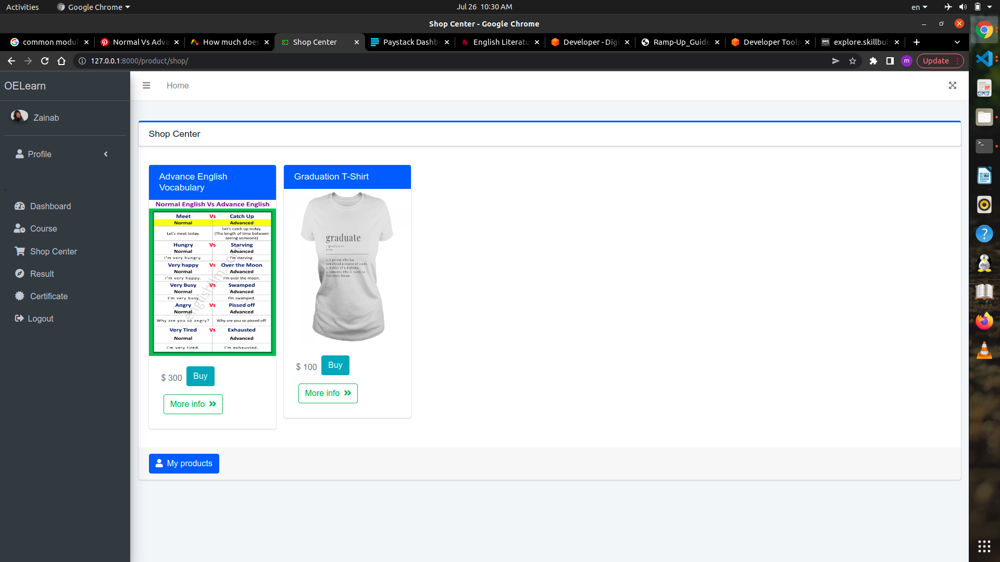

# OELERN - Online Learning School
* This is an online school learning platform implemented using Django web framework
* It is suitable for the online school that admin students according to batch, give wide variety of online courses to enroll for certain amount or for free.
* Upon sign in, the system redirect the use(teacher, admin, or student) to his respected dashboard.
* Each course can have any number of modules. 
* A module can have contents in form of text, image, video, and file.
* So also, a module can have assessments in form of Essay(Assignment or Test), and Objectives(Test only).
* A course have a general examination which students will take after they completed the course.
* Result for every assessment and examination can be released by admin at the end of the batch session.
* Students can then apply for certificate in any course they have completed before the beginning of new session.
* There is also a shop center where students can buy various downloadable(eg. Book) and non downloadable(eg. T-Shirt) materials.
## SCREENSHOTS
### Admin Dashboard

### Login page

### Admin | Manage Student Dashboard

### Admin | Course Dashboard

### Student Registration

### User Profile

### Student Dashboard

### Student Course Detail

### Student Obective Test

### Student Shop Center

## USER TYPES
 There two user type:
#### STUDENT
* Can be added by admin or register on the website.
* Can enroll in a the courses he wish, attend the modules published by the admin and take necessary assessments and test, and take examination as he completed the course.
* Can see the score of objected tests and examination instantly.
* Can view any course result so long as the result of the batch is released.
* Can request certificate of the completed course by paying certificate price online if certificate is not free.
* Buy from available products in the shop center.
#### TEACHER
Role of the teacher include:
* Manage(view, create, update, and delete) the contents, assessments, examination associated with any course assign to him.
* Mark the assessments and examination submitted by the students
#### ADMIN
Admin is just a teacher with admin privileges. He is a superuser that can perform any administrative task on the website. The role of admin include:
* Manage students and teachers including admin.
* Manage and and publish anything associated with any course and add student to a course as well.
* Manage batch, result and release the result of a batch.
* Upload certificate to students.
* Manage shop center.
## FEATURES
Major features include:
### Academic (Batch)
### Course
### Examination
### Result
### Certificate
### Payment (Paystack payment Gateway)
### Shop Center
## SETUP
Follow the following steps to set up this project on your local working environment.
### Step 1 - Cloning
Run the following command
```
git clone https://github.com/MBBmisau/oelearn.git
cd oelern
```
Alternatively, you can download the project in zip format, and extract it.
### Step 2 - Environment Setup
While it is not compulsary, it is highly recommended to start any project in a an independant virtual environment. With regard to this, there are many options out there. Do your own research and choose the one that is more suitable for you.

After you activate your virtual environment, run the following:
```
pip install -r requirements.txt
```
### Step 3 - Start Development Server
```
pip manage.py runserver
```
## PACKAGES
Major used in this project include:
### BACK END
* Django
* Django Bootstrap 4 (form presentation)
* Django tables 2
* Weasyprint (Django Weasyprint)
* Django intl tel input
* Django Bootstrap datepicker plus
* Django embed video
### FRONT END
* Bootstrap
* Admin LTE
* JQuery
