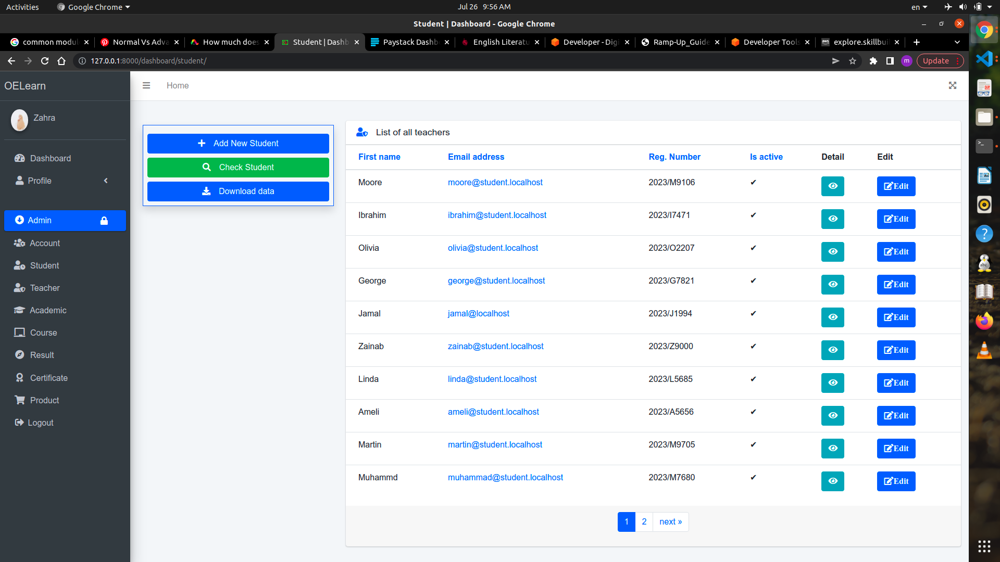

# OELERN - Online Learning School
    • This is an online school learning platform implemented using Django web framework
    • It is suitable for the online school that admin students according to batch, give wide variety of online courses to enroll for certain amount or for free.
    • Upon sign in, the system redirect the use(teacher, admin, or student) to his respected dashboard.
    • Each course can have any number of modules. 
    • A module can have contents in form of text, image, video, and file.
    • So also, a module can have assessments in form of Essay(Assignment or Test), and Objectives(Test only).
    • A course have a general examination which students will take after they completed the course.
    • Result for every assessment and examination can be released by admin at the end of the batch session.
    • Students can then apply for certificate in any course they have completed before the beginning of new session.
    • There is also a shop center where students can buy various downloadable(eg. Book) and non downloadable(eg. T-Shirt) materials.
## SCREENSHOTS
### Admin Dashboard

### Login page

### Admin | Manage Student Dashboard

### Admin | Course Dashboard

### Student Registration

### User Profile

### Student Dashboard

### Student Course Detail

### Student Obective Test

### Student Shop Center

## FEATURES
## SETUP
## PACKAGES
